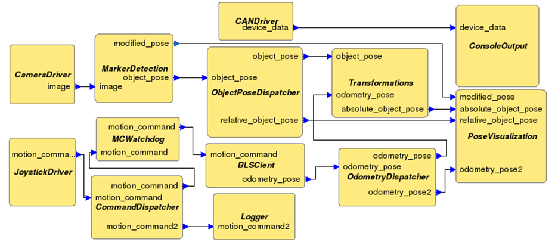

# Planetary Exploration Demonstrator Replay

# Architecture

# Taste Interface

# Issues

In any case there is a GR740 communicating with a x86 partition, all involved interface parameters have to be encoded using **UPER**.
Otherwise there will be endianess and conversion issues.

There are some problems with proper de-/encoding using the functions from **types/base\_support**.
Some of the functions do not properly set the *nCount* fields of the ASN1 structures.
